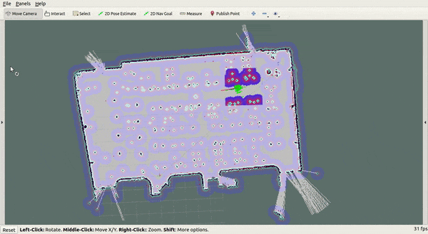

SOAR LinoRobot F4stB0is Practice!
===
Authors:
- James Raphael Tiovalen
- Dody Senputra
- Chung Wah Kit
- Wen Kang
- Kevin Ma Yuchen
- He Haolan
- Brendan Ong
- Sean
- Ragul Balaji

Credits to the [original Linorobot repository](https://github.com/linorobot/linorobot/)!


## Table of Contents <a name="top"></a>

- [SOAR LinoRobot F4stB0is Practice!](#soar-linorobot-f4stb0is-practice)
  - [Table of Contents](#table-of-contents)
  - [Objectives and Deliverables](#objectives-and-deliverables)
    - [Objectives](#objectives)
    - [Deliverables](#deliverables)
    - [Extra Objectives](#extra-objectives)
  - [Preparation](#preparation)
    - [Software Pre-requisites](#software-pre-requisites)
    - [Skill Pre-requisites](#skill-pre-requisites)
    - [Project Setup *[Ubuntu 18.04 with Melodic ROS]*](#project-setup-ubuntu-1804-with-melodic-ros)
      - [ROS (Your Computer)](#ros-your-computer)
      - [ROS (Raspberry Pi)](#ros-raspberry-pi)
  - [Setting up LinoRobot](#setting-up-linorobot)
    - [Setup Teensy](#setup-teensy)
  - [SSH Login Guide](#ssh-login-guide)
  - [Calibration](#calibration)
    - [Header Constants (for Odometry)](#header-constants-for-odometry)
    - [IMU](#imu)
    - [PID](#pid)
    - [LIDAR TF](#lidar-tf)
  - [SLAM and Autonomous Navigation](#slam-and-autonomous-navigation)
    - [SLAM](#slam)
    - [Autonomous Navigation](#autonomous-navigation)
  - [Components](#components)
    - [Controller/Driver](#controllerdriver)
    - [Sensors](#sensors)
  - [Additional Resources](#additional-resources)

## Objectives and Deliverables

Come back here if you do not know what has to be done!
> **Target Deadline: 18 July 2019, 7pm**

### Objectives

[go to top](#top)

- Become acquainted with Ubuntu and ROS
- Learn how to get a basic ROS robot up and running

### Deliverables

[go to top](#top)

Some of these have to be demonstrable by every individual in the group - so help each other out and make sure everyone crosses the finish line as a team!

- Build the Linorobot (Team)
- Set-up the Linorobot (Team)
- Able to start-up the Linorobot to perform basic SLAM and Teleoperation (Individual)
- Able to write a basic Publisher-Subscriber Node Package (Individual)
    - [methylDragon's ROS Guide](https://github.com/methylDragon/coding-notes/tree/master/Robot%20Operating%20System%20(ROS)) might come useful!

### Extra Objectives

[go to top](#top)

If you are **truly a f4stb0i** and finished the previous tasks, here are some other tasks you can tackle to improve your skills further!

- Write a ROS Service and ROS Action Node Package
- Complete all ROS package tasks in both ROS Python and ROS C++
- Get Linorobot to run in Gazebo simulator
- Use the Laser filtering package to refine the LIDAR output from the Linorobot

## Preparation

Before jumping in - remember to complete these things!

### Software Pre-requisites

[go to top](#top)

- Dual Boot [Ubuntu 18.04](https://www.ubuntu.com/download/desktop)
- Install ROS
    - [ROS Melodic Install Guide](http://wiki.ros.org/melodic/Installation/Ubuntu)
    - [methylDragon's Quick Install Scripts](https://github.com/methylDragon/quick-install-scripts/tree/master/Linux)
- (Optional) Install [Terminator](https://blog.arturofm.com/install-terminator-terminal-emulator-in-ubuntu/)
    - Also available in methylDragon's quick install scripts

### Skill Pre-requisites

[go to top](#top)

- Linux
    - [Linux File System](https://youtu.be/HbgzrKJvDRw)
- Bash Terminal
    - Play [Terminus](http://web.mit.edu/mprat/Public/web/Terminus/Web/main.html) - an educational game by MIT!
- Basic Python/C++
    - [Codecademy Python](https://www.codecademy.com/learn/learn-python)
    - [methylDragon's Python Guide](https://github.com/methylDragon/coding-notes/tree/master/Python%203)
    - [Learn C++](https://www.learncpp.com/)
    - [methylDragon's C++ Reference](https://github.com/methylDragon/coding-notes/tree/master/C%2B%2B)
- [Nano](https://www.howtogeek.com/howto/42980/the-beginners-guide-to-nano-the-linux-command-line-text-editor/) / [Vim](https://www.openvim.com/) / [EMACS](https://www.gnu.org/software/emacs/tour/) or any other terminal text editor
    - It will make things a lot easier we promise!

### Project Setup *[Ubuntu 18.04 with Melodic ROS]*

> Please ensure that the '$' is not copied when copy-pasting codes. #duh

#### ROS (Your Computer):

[go to top](#top)

1. Installation
    ```
    $ sudo sh -c 'echo "deb http://packages.ros.org/ros/ubuntu $(lsb_release -sc) main" > /etc/apt/sources.list.d/ros-latest.list'
    $ sudo apt-key adv --keyserver 'hkp://keyserver.ubuntu.com:80' --recv-key C1CF6E31E6BADE8868B172B4F42ED6FBAB17C654
    $ sudo apt update
    $ sudo apt install ros-melodic-desktop-full
    $ sudo rosdep init
    $ rosdep update
    ```
2. To add ROS environment automatically a new terminal session is started. **(optional)**
    ```
    $ echo "source /opt/ros/melodic/setup.bash" >> ~/.bashrc
    $ source ~/.bashrc
    ```
3. Create a ROS Workspace. (We are using catkin because rosbuild is no longer maintained.)
    ```
    $ mkdir -p ~/catkin_ws/src
    $ cd ~/catkin_ws/
    $ catkin_make
    ```
    Running catkin_make the first time in your workspace, it will create a `CMakeLists.txt` link in your `src` folder. Additionally, if you look in your current directory you should now have a `build` and `devel` folder. Inside the `devel` folder you can see that there are now several `setup.bash` files. Sourcing any of these files will overlay this workspace on top of your environment. 
    
4. Source your new `setup.bash` file:
    ```
    $ source devel/setup.bash
    ```
5. To make sure your workspace is properly overlayed by the setup script, make sure **ROS_PACKAGE_PATH** environment variable includes the directory you're in.
    ```
    $ echo $ROS_PACKAGE_PATH
    /home/youruser/catkin_ws/src:/opt/ros/kinetic/share
    ```
6. Congratulations! You have setup your workspace! Remember to `source devel/setup.bash` in your workspace folder everytime you want to work on your workspace. Happy Coding!

#### ROS (Raspberry Pi):

[go to top](#top)

Plug your keyboard and monitor to your raspberry pi before continuing.
1. Connect the Rasp Pi to a power supply and wait for it to turn on.
2. Install Ubuntu Mate.
3. Install ROS. (We are using methylDragon's script.)
4. SSH-ing to the bot requires several steps. Before everything, ensure that the bot is currently powered on, with the RPi connected to the same WiFi connection as your computer.

    Firstly, if you haven't done so, setup the SSH on the RPi by inputting these commands:

    ```
    # Install SSH
    $ sudo apt install openssh-server

    # Enable SSH
    $ sudo systemctl enable ssh

    # Finally, activate the SSH service
    $ sudo systemctl start ssh

    # Ensure that the firewall allows port 22
    $ sudo ufw allow 22

    # Checking SSH status
    $ systemctl is-enabled ssh
    $ systemctl is-active ssh

    # If you want to stop SSH
    $ sudo systemctl stop ssh
    $ sudo systemctl disable ssh
    $ sudo ufw deny 22
    ```

2. Next, we need to setup the network on the RPi. Go to your WiFi Settings and set a static IP. If you are using SUTD-Wifi, you can do this by going to the `IPv4` tab, setting the `Method` to `Manual` and inputting the required information. To make sure that it is working properly, first input these commands:

    ```
    # IP Address and Netmask
    # SUTD Wifi: 10.12.XXX.XXX and 255.255.0.0
    $ ip addr show
    $ ifconfig

    # Gateway
    # SUTD Wifi: 10.12.0.1
    $ ip route | grep default
    ```

3. Use the same Netmask and Gateway addresses, but not the same IP Address (choose a random value for `XX.XXX`). You can use `8.8.8.8` for DNS. After setting these up, reconnect to the WiFi.

    Finally, generate new SSH keys by inputting these commands:

    ```
    # Deleting any obselete, conflicting keys
    $ sudo rm -f /etc/ssh/ssh_host_*

    # Generate new keys
    $ sudo dpkg-reconfigure openssh-server
    ```

## Setting up LinoRobot

[go to top](#top)

Once you have installed ROS on both computers, install Linorobot's packages and dependencies.

SSH to your robot's computer and clone the install package:
```
$ cd ~
$ git clone https://github.com/linorobot/lino_install
$ cd lino_install
```
        
For Raspberry Pi, it is recommended to have a swap file to prevent the initial build from failing. You can disable this once the installation is done.
```
$ sudo apt-get install dphys-swapfile
```
Run the install file where:

base = 2wd, 4wd, ackermann, mecanum
sensor = xv11, rplidar, ydlidar, hokuyo, kinect, realsense
        
```
# For our case it gonna be ./install 2wd rplidar
$ ./install base sensor
```

On your development computer, install the packages you need for configuration and visualization:
```
$ cd ~/<your workspace folder/src
$ git clone https://github.com/linorobot/lino_pid.git
$ git clone https://github.com/linorobot/lino_msgs.git
$ git clone https://github.com/linorobot/lino_visualize.git
$ sudo apt-get install ros-$(rosversion -d)-teleop-twist-keyboard
$ cd .. && catkin_make
```

To allow ROS to communicate between the development computer (ROS Master) and the slave robot(s), we need to set up the environment variables properly.

For the `.bashrc` file on development computer, make sure that it has these lines (if not, then add them):

```
export ROS_HOSTNAME=[DEVELOPMENT_COMPUTER_IP_ADDRESS]
export ROS_MASTER_URI=http://localhost:11311 # The name 'localhost' is already defined by default as an alias for 127.0.0.1, which is NOT the development computer's IP Address
```
        
For the `.bashrc` file on the slave robot(s), make sure that it has these lines (if not, then add them):
        
```
export ROS_HOSTNAME=[LINOROBOT_STATIC_IP_ADDRESS]
export ROS_MASTER_URI=http://[DEVELOPMENT_COMPUTER_IP_ADDRESS]:11311
```
        
Don't forget to source them after editing them.

```
$ source ~/.bashrc
```
        
(NOTE: Alternatively, we can define the IP Addresses in the respective `/etc/hosts` file on each system with aliases, which we can refer to in the respective `.bashrc` file.)


### Setup Teensy

[go to top](#top)

> Since we are using Ubuntu MATE 18.04, we need to apply some fixes and install some missing packages (while ROS Melodic is officially supported, we need to manually fix some issues.)
1. Download the `python-gudev` package from [here](https://launchpad.net/ubuntu/+archive/primary/+files/python-gudev_147.2-3_armhf.deb).
    Install it by using `dpkg`.
    ```
    $ sudo dpkg -i <filepath>.deb
    $ sudo apt install -f
    ```
2. Install pip.
    ```
    $ sudo apt install python-pip
    ```
3. Install platformio.
    ```
    $ sudo pip install platformio
    ```
4. Compile firmware and upload it to Teensy.
    ```
    $ platformio run ---target upload
    ```
5. Install the `interactive-markers` ROS package.
    ```
    $ sudo apt install ros-melodic-interactive-markers
    ```
    > Alternatively, we can use this command to magically install most of the missing dependencies for the Linorobot workspace:
    > ```
    > $ rosdep install --from-paths src --ignore-src -r -y
    > ```

6. Check if we need to skip/modify the `if` check in the `.cpp` code. (For our case, we need to edit the `MPU9250.cpp` file at lines 74-81. This might be due to us using a slightly different IMU model.)
    ```
    bool MPU9250::testConnection() {
    uint8_t device_id = getDeviceID();

    if(device_id == 0x38 || device_id == 0x71)
        return true;
    else 
        return false;
    }
    ```
7. Install the `slam-gmapping` package. Since it is not yet available for ROS Melodic, build it from source.
    ```
    $ git clone https://github.com/ros-perception/openslam_gmapping.git
    ```
8. Remove all slashes (`/`) from `global_costmap_params.yaml` and `local_costmap_params.yaml`.
This is because we are using `tf2` (instead of `tf`).

9. Install the `global-planner` package on RPi.
    ```
    $ sudo apt install ros-melodic-global-planner
    
    # Alternative method (it will install global-planner, which is a dependency)
    $ sudo apt install ros-melodic-navigation
    ```
10. Install the `libyaml-cpp-dev` package on RPi. (This is optional, just in case if the package is not yet installed for ROS Melodic.)
    ```
    $ sudo apt install libyaml-cpp-dev
    ```

## SSH Login Guide

[go to top](#top)

Login credentials of LinoRobot's Raspberry Pi Ubuntu MATE 18.04:

```
hostname: sl0wboisTT
username: [REDACTED]
password: [REDACTED]
```

 You can `ssh` from your computer to the RPi by using this command:

```
$ ssh username@[LINOROBOT_STATIC_IP_ADDRESS]
```

SSH password is the same as the one in the aforementioned login credentials.

You can run ROS Master on the development computer using the `roscore` command. You can try publishing something from the development computer and try subscribing to it from the Linorobot to ensure that it works.

A simple example would be to run:

```
$ rosrun roscpp_tutorials talker
```

on the development computer, and run:

```
$ rostopic echo /chatter
```

on the Linorobot.

## Calibration

### Header Constants (for Odometry)

[go to top](#top)

For Odometry, we need the position (or displacement), linear velocity and angular velocity to be approximately of the correct magnitude and direction. It needs to pass the stationary rotation test and the square-shaped pattern origin test as well. It's fine if the loop didn't close as AMCL will correct the robot's pose eventually.
Edit the `lino_base_config.h` to define your Robot Base, Motor Driver, IMU and Robot's Specification:
```
//uncomment the base you're building
#define LINO_BASE DIFFERENTIAL_DRIVE // 2WD and Tracked robot w/ 2 motors
// #define LINO_BASE SKID_STEER      // 4WD robot
// #define LINO_BASE ACKERMANN       // Car-like steering robot w/ 2 motors
// #define LINO_BASE ACKERMANN1      // Car-like steering robot w/ 1 motor
// #define LINO_BASE MECANUM         // Mecanum drive robot

//uncomment the motor driver you're using
#define USE_L298_DRIVER
// #define USE_BTS7960_DRIVER
// #define USE_ESC

//uncomment the IMU you're using
// #define USE_GY85_IMU
// #define USE_MP6050_IMU
// #define USE_MPU9150_IMU
#define USE_MPU9250_IMU

//define your robot's specs here
#define MAX_RPM 3000              // motor's maximum RPM
#define COUNTS_PER_REV 2200       // wheel encoder's no of ticks per rev
#define WHEEL_DIAMETER 0.0678     // wheel's diameter in meters
#define PWM_BITS 8                // PWM Resolution of the microcontroller
#define LR_WHEELS_DISTANCE 0.215  // distance between left and right wheels
#define FR_WHEELS_DISTANCE 0.30   // distance between front and rear wheels. Ignore this if you're on 2WD/ACKERMANN
#define MAX_STEERING_ANGLE 0.415  // max steering angle. This only applies to Ackermann steering
```

### IMU

[go to top](#top)

Open 2 terminals and run:
```
$ roslaunch linorobot minimal.launch

$ roscd linorobot/param/imu
$ mv imu_calib.yaml imu_calib0.yaml 
$ rosrun imu_calib do_calib
```
Follow the on-screen instructions to calibrate the IMU. Once done, verify that the calibration file has been saved.
```
$ ls imu_calib.yaml
```

### PID

[go to top](#top)

On your robot's computer, run:
```
$ roslaunch linorobot minimal.launch
```

On your development computer, open 3 new terminal consoles and run:
```
$ rosrun lino_pid pid_configure

$ rosrun teleop_twist_keyboard teleop_twist_keyboard.py

$ rqt
```
In `rqt`, import the `~/catkin_ws/src/lino_pid/lino_pid.perspective` file.
Click `pid_configure` under Dynamic Reconfigure and slide the parameters to tune the PID constants.

> PID Tips:
> 1. Start with 0 for all.
> 2. Increase P slowly until the motors start to vibrate like crazy, then drop the P value back to just before it starts to vibrate.
> 3. When you start driving it, it should have some dumb oscillations when you try to turn or start stop, so increase D slowly until it's reduced.
> 4. Increase I if needed when you realize that it has steady state errors.

Once the PID constants are tuned, record the values in the `lino_base_config.h` file:
```
#define DEBUG 0 // Disable debug mode

#define K_P 1.4 // P constant
#define K_I 1.2 // I constant
#define K_D 0.5 // D constant
```

### LIDAR TF

[go to top](#top)

> If you have a low power source, LIDAR should be connected before turning on the RPi. A power surge might happen when starting anything LIDAR-related. Reboots might help. It might seem simple, but without enough power, the LIDAR would not be able to turn on when launching ```bringup```. This is a common pain point during testing.

Firstly, configure your robot base's TF by running:
```
$ roscd linorobot/launch
$ nano bringup.launch
```
Measure the distance between the floor and the center of the robot base. Define the measured distance on the third value found in "args" param.
```
<node pkg="tf2_ros" type="static_transform_publisher" name="base_footprint_to_base_link" args="0 0 0.05 0 0 0  /base_footprint /base_link"/>
```

Secondly, configure your laser's TF by running:
```
$ roscd linorobot/launch/include
$ nano laser.launch
```
Determine the LIDAR's location from the center of the base and change the first three numbers in "args" to your measured offsets.
```
<node pkg="tf2_ros" type="static_transform_publisher" name="base_link_to_laser"
args="-0.05 0 0.102 0 0 0  /base_link /laser"/>
```

To check the laser's TF, open 2 new terminal consoles on the robot's computer and run:
```
$ roslaunch linorobot bringup.launch

$ roslaunch linorobot laser.launch
```
On your development computer, run:
```
$ roscd lino_visualize/rviz
$ rviz -d laser.rviz
```
Place the robot 1 m away from a wall. Check on RViz if the wall detected is approximately 1 m. Each square in RViz is 1 square meter.

## SLAM and Autonomous Navigation

### SLAM

[go to top](#top)

On the robot's computer, open 2 new terminal consoles and run both commands:

```
$ roslaunch linorobot bringup.launch

$ roslaunch linorobot slam.launch
```

On your development computer, open 2 new terminal consoles and run both commands:

```
$ rosrun teleop_twist_keyboard teleop_twist_keyboard.py

$ roscd lino_visualize/rviz
$ rviz -d slam.rviz
```

> Start mapping from a location where there are a lot of features. Try not to bump into anything while mapping. Whenever the `m_count` function is called, stop the Linorobot immediately (no translation or rotation whatsoever) in order to prevent inaccurate mapping (failed scan matching with odometry). Occassional autocorrection is possible, but do not rely on it. Monitor the average scan matching score in the console (maintain it at preferably above 100). Tip: use linear speed of about 0.15 and angular speed of about 0.5.

After mapping is done, save the map by running this command on the robot's computer:
```
$ rosrun map_server map_saver -f ~/linorobot_ws/src/linorobot/maps/map
```

Check if the map has been saved:
```
$ roscd linorobot/maps
$ ls -a map.pgm map.yaml
```

### Autonomous Navigation

[go to top](#top)

Edit `costmap_common_params.yaml`:
```
$ roscd linorobot/param/navigation
$ nano costmap_common_params.yaml
```
and define the robot's footprint (size):
```
# x = ROBOT_LENGTH / 2
# y = ROBOT_WIDTH / 2
footprint: [[-x, -y], [-x, y], [x, y], [x, -y]]
```

Before navigation, ensure that line 3 of the `navigate.launch` file is:
```
# map.yaml instead of house.yaml
<arg name="map_file" default="$(find linorobot)/maps/map.yaml"/>
```

On the robot’s computer, open 2 new terminal consoles and run these 2 commands:
```
$ roslaunch linorobot bringup.launch

$ roslaunch linorobot navigate.launch
```


On your development computer, run:
```
$ roscd lino_visualize/rviz
$ rviz -d navigate.rviz
```

Finally, use "2D Post Estimate" to set the robot's initial pose and use "2D Nav Goal" to send a goal to the robot on **RViz**.



Yay! We're done!

## Components

### Controller/Driver

[go to top](#top)

- [Motor driver] TB6612FNG (https://learn.sparkfun.com/tutorials/tb6612fng-hookup-guide/all)
    - Flipped over on breadboard so the pins are reversed
    - Pin with a dot is VM
    - NB: Plug STBY (Standby Input) into +3.3v, if not no motors will spin
    - In theory these will work:
        - L298_DRIVER (stops the motors by setting PWM pin=0)
        - 7960_DRIVER (stops the motors by setting AIN1/BIN1=0 and AIN2/BIN2=0)
- [Development Board(like an arduino)] Teensy 3.2 (https://www.pjrc.com/store/teensy32.html)
    - You can use the Arduino IDE (C++) with this: (https://www.pjrc.com/teensy/td_download.html)

### Sensors

[go to top](#top)

- **Motor/Encoder Model**: CHR-GM37-520 (https://p.globalsources.com/IMAGES/PDT/SPEC/581/K1109503581.pdf)
    - Pins:
        - M1/2: Motor Power
        - C1/2: Control
        - GND: Ground
        - VCC: Encoder Power
    - Measuring the `counts_per_rev`:
        - Check the encoder reading first, then turn the motor for 10 rounds, get the difference in encoder reading and the `counts_per_rev` is the difference divided by 10.
- **IMU 3-Axis Gyro/Acceleration/Magnetic Field**: MPU-9250 (http://web.archive.org/web/20171126001659/http://www.iseerobot.com/produk-1795-gy9255-mpu9265--sensor-module.html)
    - VCC: Power
    - GND: Ground
    - SCL: Serial Clock Line
    - SDA: Serial Data
    - I2C device addresses:
        - 0x73
        - Might need to override any check/add the new device address for the identity of the IMU:
            - `if(device_id == 0x38 || device_id == 0x71)`
        - File is found in `~/linorobot_ws/src/linorobot/teensy/firmware/lib/imu/MPU9250.cpp`
- **LIDAR**: RPLIDAR A1M8
    - Reference: 
        - Software: https://wiki.ros.org/rplidar
        - Datasheet: http://bucket.download.slamtec.com/b90ae0a89feba3756bc5aaa0654c296dc76ba3ff/LD108_SLAMTEC_rplidar_datasheet_A1M8_v2.2_en.pdf
        - Github Repo: https://github.com/Slamtec/rplidar_ros
    - Communication: Serial with CP2102 UART to USB Converter
    - Getting started with RPLidar
        - Use `dmesg` to check if RPLidar is attached to `/dev/ttyUSB0` (usually is by default)
        - Add write permissions by `sudo chmod 666 /dev/ttyUSB0`
        - Then run node with default configuration using `roslaunch rplidar_ros view_rplidar.launch`
        - View raw Point Cloud data generated by rplidarNode published on the `scan` topic using RViz
            - Run RViz using `rviz rviz` in the terminal
            - Set reference frame to 'laser' (default frame_id of rplidarNode)
            - Add LaserScan to the left pane using the Add button then set the topic to subscribe to as `scan`

## Additional Resources

[go to top](#top)

- [Linorobot Webpage](https://linorobot.org/)
- [Linorobot Github](https://github.com/linorobot/linorobot)
- [Linorobot Tutorial: Part 1](https://github.com/linorobot/linorobot/wiki/1.-Getting-Started)
- [ROS Official Tutorial](http://wiki.ros.org/ROS/Tutorials)
- [methylDragon's ROS Guide](https://github.com/methylDragon/ros-tutorials)
- [methylDragon's Quick Install Scripts](https://github.com/methylDragon/quick-install-scripts/tree/master/Linux)
- [Codecademy Python](https://www.codecademy.com/learn/learn-python)
- [methylDragon's Python Guide](https://github.com/methylDragon/coding-notes/tree/master/Python%203)
- [Learn C++](https://www.learncpp.com/)
- [methylDragon's C++ Reference](https://github.com/methylDragon/coding-notes/tree/master/C%2B%2B)
- [Terminus](http://web.mit.edu/mprat/Public/web/Terminus/Web/main.html)
- [Nano Guide](https://www.howtogeek.com/howto/42980/the-beginners-guide-to-nano-the-linux-command-line-text-editor/)
- [Interactive Vim Tutorial](https://www.openvim.com/)
- [EMACS Guide](https://www.gnu.org/software/emacs/tour/)
- [Quick ~/.bashrc file Guide](https://www.lifewire.com/bashrc-file-4101947)

###### tags: `Documentation`

